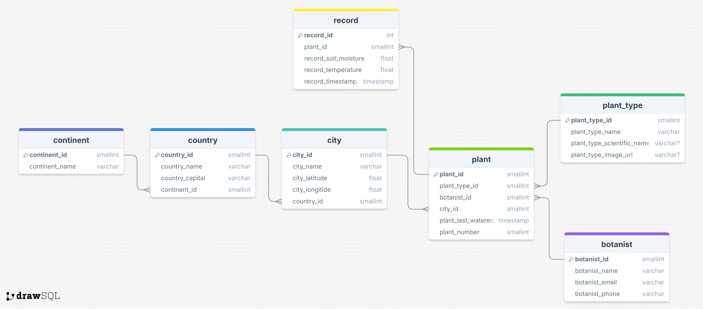

# Database  

This directory contains the SQL Server database schema and related scripts for connecting to the database, run the main.tf file before running these scripts.  

## Files  

### Database Creation Script  
- [`create_db.sh`](create_db.sh) – A Bash script used to create a database called "lmnh" in the SQL Server RDS.  

### Database Connection Script  
- [`connect_db.sh`](connect_db.sh) – A Bash script used to establish a connection to the SQL Server database named "lmnh".  

### Schema Script  
- [`schema.sql`](schema.sql) – This script defines the database schema, including table creation and insertion of static data.  

### ERD Diagram  
-  – Entity-Relationship Diagram (ERD) illustrating the database structure.  
