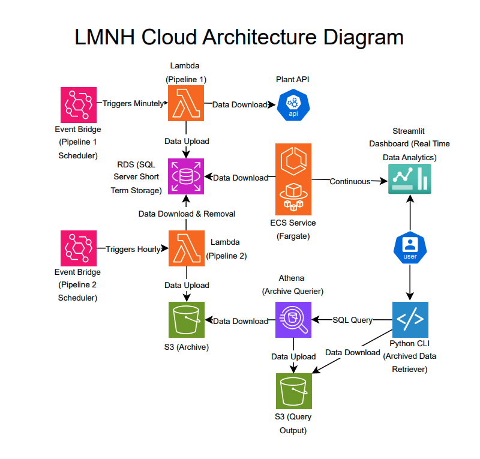

# Architecture

### Architecture Diagram  
 
– Cloud Architecture diagram of the implemented data pipeline solution.  

This data pipeline is designed for efficiency, scalability, and cost-effectiveness using AWS services. EventBridge serves as the central scheduler, triggering key processes at different intervals. Every minute, an EventBridge schedule triggers Lambda Pipeline 1, which extracts data from the LMNH Plant API, transforms it, and loads it into an RDS SQL Server database, chosen for its reliability, structured query capabilities, and seamless AWS integration. Lambda functions were used for their serverless nature, allowing for automatic scaling and a cost-effective way to execute the ETL tasks without the need for managing infrastructure. Meanwhile, an ECS service running on AWS Fargate provides a continuously updating Streamlit dashboard, delivering real-time insights into the processed data.

Every hour, a second EventBridge schedule triggers Lambda Pipeline 2, which extracts data from the RDS that is over 24 hours old, transforms it, and loads it into an S3 archive bucket, leveraging S3’s cost-effective and scalable storage. A CLI-based Python script enables users to interact with the archived data by sending queries and retrieving results efficiently. This script allows users to execute Athena queries on the archived data in S3 and then download the resulting CSV file from the S3 query bucket—all from the command line—for further analysis.

## Directory Structure

The following subdirectories contain Terraform scripts for specific AWS services. Each subdirectory includes a `main.tf` script and a `variables.tf` file, the scripts should be run in the order they appear below:

### **1.RDS**  
[`1.rds/`](1.rds/) – Contains Terraform scripts to create and configure an AWS RDS instance with a SQL Server engine. Additionally, this directory also contains [`RDS/DATABASE`](1.rds/database) which contains documentation of how to create and connect to the database.
For more details, refer to the [RDS README](1.rds/README.md).

### **2.S3**  
[`2.s3/`](2.s3/) – Contains Terraform scripts to create and manage an Amazon S3 bucket.  
For more details, refer to the [S3 README](2.s3/README.md).

### **3.ECR**  
[`3.ecr/`](3.ecr/) – Contains Terraform scripts to create and manage an AWS Elastic Container Registry (ECR) repository.  
For more details, refer to the [ECR README](3.ecr/README.md).

### **4.Lambda**  
[`4.lambda/`](4.lambda/) – Contains Terraform scripts to deploy an AWS Lambda function with associated IAM roles and permissions.  
For more details, refer to the [Lambda README](4.lambda/README.md).

### **5.EventBridge**  
[`5.eventbridge/`](5.eventbridge/) – Contains Terraform scripts to configure AWS EventBridge rules and event-driven workflows.  
For more details, refer to the [EventBridge README](5.eventbridge/README.md).

### **6.ECS**  
[`6.ecs/`](6.ecs/) – Contains Terraform scripts to provision an AWS Elastic Container Service (ECS) cluster and associated resources.  
For more details, refer to the [ECS README](6.ecs/README.md).

### **7.Athena Database**  
[`7.athena_database/`](7.athena_database/) – Contains Terraform scripts to create and manage an AWS Athena database.  
For more details, refer to the [Athena Database README](7.athena_database/README.md).  

### **8.Athena Table**  
[`8.athena_table/`](8.athena_table/) – Contains Terraform scripts to define and manage tables within an AWS Athena database.  
For more details, refer to the [Athena Table README](8.athena_table/README.md).